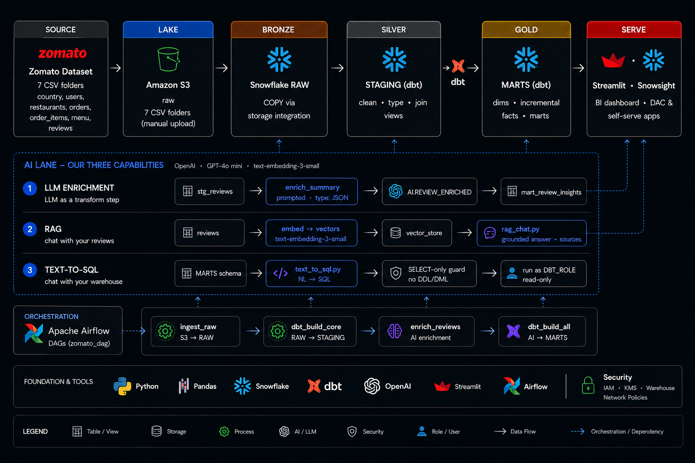
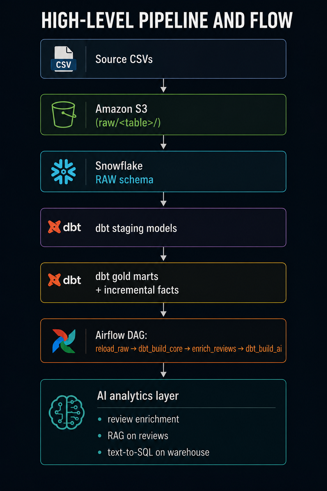
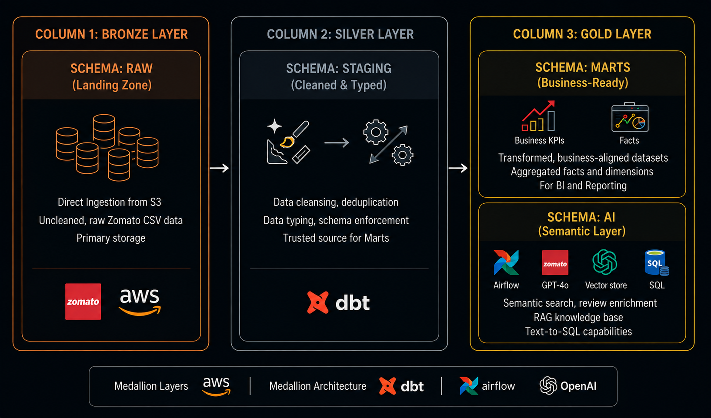
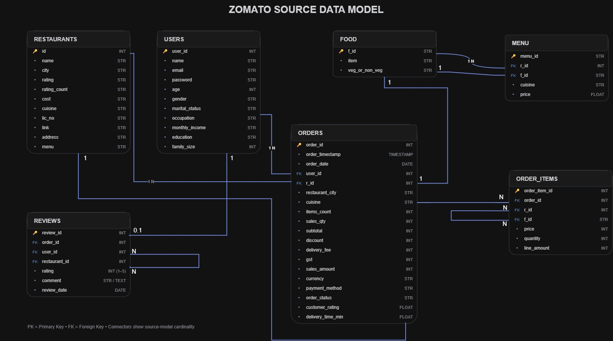
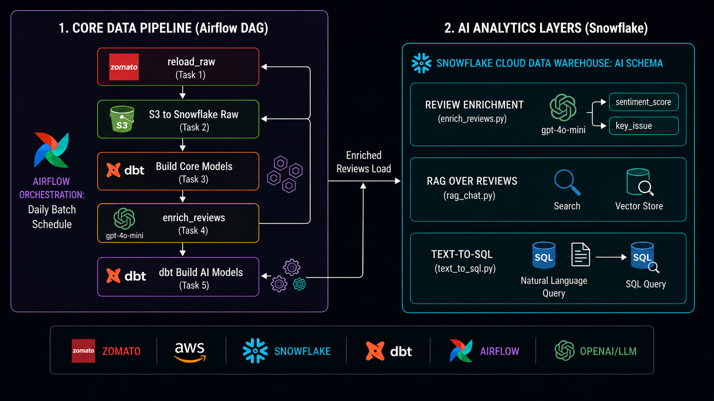

# Zomato AI Data Engineering — End-to-End Project

A complete batch data pipeline that takes Zomato-style food delivery data from raw CSVs all the way to AI-powered analytics.

Zomato/Food Delivery Dataset → Amazon S3 → Snowflake → dbt → Airflow → AI (OpenAI)

The dataset lands in an S3 data lake and flows into Snowflake through a storage integration, where dbt transforms it through medallion layers — RAW (Bronze) tables loaded via COPY INTO, cleaned STAGING (Silver) views, and business-ready MARTS (Gold) with dimensions, incremental facts, and aggregate marts. Apache Airflow orchestrates the whole pipeline as one daily DAG. On top of the warehouse sits an AI lane powered by OpenAI: LLM enrichment turns free-text reviews into structured, queryable columns; RAG lets you chat with your reviews; and text-to-SQL lets you query the warehouse in plain English. Streamlit serves the dashboards and AI apps.



> 📂 Dataset + project slides: [Google Drive folder](https://drive.google.com/drive/folders/1_xcTtGbuZYmWUAdXz8YB4qjainPr6D6V?usp=sharing) — the raw CSVs are kept outside the repo because they are too large to commit to GitHub.

---

## What gets built

| Layer | Where | What |

| --- | --- | --- |

| Source | local/raw data source | restaurant, user, food, menu, order, order_item, and review data |

| Lake | Amazon S3 | one bucket with raw folder structure per table |

| Bronze | Snowflake RAW | COPY INTO from S3 through storage integration |

| Silver | Snowflake STAGING | dbt staging views for cleaning, typing, and standardization |

| Gold | Snowflake MARTS | dimensions, incremental facts, aggregate marts, KPI tables |

| AI | Snowflake AI | review enrichment, RAG, text-to-SQL |

| Orchestration | Airflow (Docker) | daily DAG for load → transform → enrich → AI mart |

---

## Tech stack

Python · Pandas · Amazon S3 · Snowflake · dbt (dbt-snowflake) · Apache Airflow 3 (Docker) · OpenAI (gpt-4o-mini, text-embedding-3-small) · Streamlit

---

## Repository structure

```text

├── ai/

│   ├── enrich_reviews.py

│   ├── example.env

│   ├── rag_chat.py

│   └── text_to_sql.py

├── airflow/

│   ├── Dockerfile

│   ├── docker-compose.yaml

│   ├── example.env

│   └── dags/

│       └── zomato_batch.py

├── aws/

│   └── iam/

│       ├── s3-read-policy.json

│       ├── snowflake-role-trust-policy-final.json

│       └── snowflake-role-trust-policy-initial.json

├── docs/

│   ├── architecture.png

│   └── Zomato_Data_Model.jpg

├── snowflake/

│   ├── 01_setup.sql

│   ├── 02_storage_integration.sql

│   ├── 03_stage_and_formats.sql

│   ├── 04_raw_tables.sql

│   └── 05_copy_into.sql

├── zomato/

│   ├── README.md

│   ├── analyses/

│   ├── dbt_project.yml

│   ├── macros/

│   ├── models/

│   ├── snapshots/

│   └── tests/

├── .gitignore

├── README.md

├── LICENSE

└── .venv/

```

> The raw data files are intentionally not committed to GitHub because they are too large. Download them from the Drive link above and place them in your local raw-data location before running the pipeline.

---

## 1. End-to-end pipeline flow

The project follows a clear production-style data pipeline from raw files to trusted analytics and AI-driven business insight.



### Flow in one sequence

1. Source datasets are collected as CSVs for restaurants, users, food, menu, orders, order items, and reviews.

2. The files are landed in Amazon S3 as raw data in a lake folder structure such as `s3://<BUCKET>/raw/<table>/`.

3. Snowflake reads the raw files through a storage integration and loads them into the RAW schema using COPY INTO.

4. dbt transforms the data in the staging and mart layers: cleaning, typing, deduplicating, standardizing, and building fact and dimension models.

5. Apache Airflow orchestrates the end-to-end process in one DAG so the load, dbt transformation, and AI enrichment run in a controlled sequence.

6. The AI layer enriches review text, enables RAG on reviews, and supports natural-language querying with text-to-SQL across the warehouse.

This pipeline turns raw operational records into trusted, business-ready analytics and actionable insights.

### Business questions this pipeline answers

- Which cities generate the most revenue?

- Which restaurants perform best by rating and delivery time?

- What are the top delivery issues reported by customers?

- Which food items or cuisines are most popular?

- How can AI help interpret sentiment and reveal insight from reviews?

---

**

2. Data Engineering Concepts Demonstrated & Applied

This section maps the core Data Engineering concepts used in this project to the place where each concept is applied. The goal is to show not only which technologies are used, but also why each technology and design pattern is part of the pipeline.

2.1 Batch Processing

Core concept: Batch processing collects data and processes it together at scheduled intervals rather than processing every event immediately.

Applied in this project: The Zomato datasets are processed as a daily batch pipeline, coordinated by Airflow.

Source CSVs → Daily Batch → Amazon S3 → Snowflake → dbt → AI Layer

Concept demonstrated: Batch Processing

2.2 Data Lake and Raw Data Preservation

Core concept: A data lake provides scalable object storage for raw data before analytical transformation.

Applied in this project: Amazon S3 acts as the raw data lake.

s3://<BUCKET>/raw/
├── restaurants/
├── users/
├── food/
├── menu/
├── orders/
├── order_items/
└── reviews/

Keeping the raw layer separate allows downstream models to be rebuilt from source data when transformation logic changes.

Where it appears: Amazon S3 / raw/<table>/

Concepts demonstrated: Data Lake, Object Storage, Raw Data Preservation

2.3 Data Organization and Storage Layout

Core concept: Data should use a predictable storage structure so ingestion, maintenance, troubleshooting, and scaling are easier.

Applied in this project: Each source entity has its own raw S3 folder.

raw/orders/
raw/reviews/
raw/restaurants/
raw/users/

Concept demonstrated: Data Organization / Storage Layout

2.4 Cloud Data Warehouse and Bulk Loading

Core concept: A cloud data warehouse provides structured storage and compute for analytical workloads.

Applied in this project:

Amazon S3
    ↓
Storage Integration
    ↓
External Stage
    ↓
File Format
    ↓
COPY INTO
    ↓
Snowflake RAW

Where it appears: snowflake/01_setup.sql through snowflake/05_copy_into.sql

Concepts demonstrated: Cloud Data Warehouse, External Storage Integration, External Stage, Bulk Loading

2.5 ELT Architecture

Core concept: ELT loads data into the analytical platform first and performs transformations there.

Extract → Load → Transform

Applied in this project:

Source CSVs → S3 → Snowflake RAW → dbt → STAGING / MARTS / AI

Concept demonstrated: ELT

2.6 Medallion Architecture

Core concept: Medallion Architecture separates data into progressively refined layers.

Bronze → Silver → Gold

Applied in this project:

Layer

Snowflake Area

Purpose

Bronze

RAW

Raw landing data

Silver

STAGING

Cleaned and standardized data

Gold

MARTS

Business-ready analytical models

AI

AI

AI-enriched and semantic workloads

Concept demonstrated: Medallion Architecture

2.7 Data Cleaning and Standardization

Core concept: Raw operational data often contains inconsistent values, missing values, unsuitable data types, and duplicates.

Applied in this project: dbt staging models perform naming normalization, type casting, null handling, deduplication, column mapping, and business standardization.

RAW
rating = "4.5"
city = " Mumbai "

      ↓ dbt staging

STAGING
rating = 4.5
city = "Mumbai"

Where it appears: zomato/models/staging/

Concepts demonstrated: Data Cleaning, Data Standardization, Type Casting, Deduplication

2.8 Data Quality

Core concept: Data quality determines whether data is complete, valid, unique, consistent, and reliable enough for downstream use.

Quality Dimension

Zomato Example

Completeness

Missing restaurant_id

Uniqueness

Duplicate order_id

Validity

Rating outside the expected range

Consistency

Different representations of the same city

Referential integrity

Order referencing a missing restaurant

Type validity

Price stored as text

These are the quality concepts addressed by the pipeline. They should only be called automated tests where the corresponding tests are actually implemented.

Concept demonstrated: Data Quality

2.9 Dimensional Modeling

Core concept: Analytical warehouses separate measurable business events from descriptive business entities.

Applied in this project: The Gold/MARTS layer contains facts, dimensions, aggregate marts, and KPI-oriented models.

                 dim_customer
                      │
dim_restaurant ── fact_orders ── dim_date
                      │
                 dim_location

Concept demonstrated: Dimensional Modeling

2.10 Star Schema

Core concept: A star schema places a central fact table around related dimension tables.

Applied in this project: The MARTS layer is designed around fact and dimension concepts for revenue, restaurant performance, customer behavior, food popularity, and delivery analysis.

fact_orders
fact_order_items

dim_customer
dim_restaurant
dim_food
dim_location
dim_date

Concept demonstrated: Star Schema

2.11 Fact Table Grain

Core concept: Grain defines exactly what one row in a fact table represents.

Applied in this project:

fact_orders
Grain = one row per order

fact_order_items
Grain = one row per order item

This distinction helps prevent incorrect aggregation because one order can contain multiple order items.

Concept demonstrated: Fact Table Grain

2.12 Gold Layer and Business Semantics

Core concept: The Gold layer converts cleaned data into business-ready models that answer analytical questions consistently.

Applied in this project: The MARTS layer contains dimensions, incremental facts, aggregate marts, and KPI tables.

Which city generates the most revenue?
Which restaurants perform best?
Which cuisines are most popular?
What are the top delivery complaints?

Concept demonstrated: Business Data Modeling / Semantic Layer

2.13 Incremental Processing

Core concept: Incremental processing updates only new or changed data instead of rebuilding the entire dataset.

Full Refresh
All records → Process everything → Target

Incremental
Existing + New/Changed
        ↓
Process changes
        ↓
Target

Applied in this project: The Gold layer includes incremental facts.

Benefits: reduced processing time, lower compute requirements, better scalability, and more efficient recurring batch execution.

Concept demonstrated: Incremental Data Processing

2.14 dbt and Analytics Engineering

Core concept: dbt applies software-engineering practices to SQL-based analytical transformations.

Applied in this project:

RAW → STAGING → MARTS → AI Models

The project uses dbt for modular SQL transformations and the repository contains models, macros, tests, configuration, and snapshots.

Where it appears: zomato/models/, macros/, tests/, dbt_project.yml

Concept demonstrated: Analytics Engineering / SQL Transformation

2.15 Workflow Orchestration

Core concept: Orchestration coordinates tasks, controls execution order, schedules workloads, and manages dependencies.

Applied in this project:

reload_raw
    ↓
S3 to Snowflake RAW
    ↓
dbt_build_core
    ↓
enrich_reviews
    ↓
dbt_build_ai

Where it appears: airflow/dags/zomato_batch.py

Concept demonstrated: Workflow Orchestration

2.16 DAG and Dependency Management

Core concept: An Airflow DAG is a Directed Acyclic Graph representing tasks and their dependencies.

Task 1 → Task 2 → Task 3 → Task 4 → Task 5

A downstream task should not run before its required upstream task has completed successfully.

Concept demonstrated: DAG, Task Dependency, Workflow Scheduling

2.17 Pipeline Reliability and Recovery

Core concept: Pipelines must be able to recover from failures.

Task Failure
    ↓
Retry / Rerun
    ↓
Success
    ↓
Continue downstream

Relevant concepts include task dependency blocking, failure isolation, reruns, backfills, and idempotent processing.

Concept demonstrated: Pipeline Reliability / Recovery

2.18 Data Lineage

Core concept: Data lineage explains where data came from and how it was transformed.

orders.csv
    ↓
S3
    ↓
Snowflake RAW
    ↓
stg_orders
    ↓
fact_orders
    ↓
Revenue / KPI Mart
    ↓
BI / AI

dbt model dependencies help make transformation relationships understandable.

Concept demonstrated: Data Lineage

2.19 AI as a Data Transformation Layer

Core concept: AI can convert unstructured text into structured analytical attributes.

Applied in this project: Review enrichment produces fields such as sentiment, sentiment_score, topic, and key_issue.

Review Text
    ↓
LLM Enrichment
    ↓
Structured Attributes
    ↓
Snowflake AI Schema

Where it appears: ai/enrich_reviews.py

Concept demonstrated: Unstructured → Structured Data Transformation

2.20 Embeddings and Vector Search

Core concept: Embeddings represent text as numerical vectors so semantically similar text can be retrieved.

Review → Embedding Model → Vector → Vector Store

The project uses embeddings as part of the RAG architecture over reviews.

Concept demonstrated: Embeddings / Vector Search

2.21 Retrieval-Augmented Generation (RAG)

Core concept: RAG combines retrieval from a knowledge source with LLM generation.

Reviews
   ↓
Embeddings
   ↓
Vector Store
   ↓
User Question
   ↓
Similarity Search
   ↓
Relevant Reviews
   ↓
LLM
   ↓
Answer

The LLM receives relevant project data rather than relying only on general model knowledge.

Where it appears: ai/rag_chat.py

Concept demonstrated: RAG, Retrieval, Vector Search, Semantic Search

2.22 Text-to-SQL

Core concept: Text-to-SQL translates a natural-language business question into SQL against the analytical warehouse.

Natural Language Question
          ↓
Schema / Context
          ↓
LLM
          ↓
SQL Query
          ↓
Snowflake
          ↓
Result

Where it appears: ai/text_to_sql.py

Concept demonstrated: Natural Language → SQL

2.23 AI Grounding and Guardrails

Core concept: LLM output should be constrained and validated before it becomes part of a data workflow.

LLM Output
    ↓
Validation / Guardrails
    ↓
Approved Structured Data or SQL
    ↓
Warehouse

Important concepts include schema grounding, structured output, SQL validation, controlled query execution, and error handling.

These should be described as implemented only where the repository contains the corresponding validation logic.

Concept demonstrated: AI Reliability / Guardrails

2.24 Security and Access Control

Core concept: Data pipelines should follow least-privilege access and keep credentials outside source code.

Applied in this project:

AWS IAM policies are maintained under aws/iam/

Snowflake roles are configured through setup scripts

credentials are supplied through environment variables

real API keys and passwords are not committed to Git

Concept demonstrated: IAM, RBAC, Least Privilege, Secret Management

2.25 End-to-End Concept Map

SOURCE
  │
  │ Batch Processing
  ▼
CSV DATA
  │
  │ Data Lake / Raw Preservation
  ▼
AMAZON S3
  │
  │ Cloud Integration / Bulk Loading
  ▼
SNOWFLAKE RAW
  │
  │ Bronze
  ▼
DBT STAGING
  │
  │ Cleaning / Typing / Deduplication
  │ Silver
  ▼
DBT MARTS
  │
  │ Star Schema / Facts / Dimensions
  │ Incremental Processing
  │ Gold
  ▼
AIRFLOW ORCHESTRATION
  │
  │ Scheduling / Dependencies / Recovery
  ▼
AI LAYER
  │
  ├── Unstructured → Structured
  │      Review Enrichment
  │
  ├── Embeddings → Vector Search → RAG
  │
  └── Natural Language → SQL
  │
  ▼
BUSINESS / AI ANALYTICS

Technology vs Data Engineering Responsibility

Technology

Responsibility

Core Concept

CSV

Source data

Batch source

Amazon S3

Raw storage

Data Lake

Snowflake

Analytical storage/compute

Cloud Data Warehouse

COPY INTO

Data loading

Bulk Ingestion

dbt

Transformation

ELT / Analytics Engineering

RAW

Raw warehouse layer

Bronze

STAGING

Cleaned data

Silver

MARTS

Business models

Gold

Airflow

Workflow control

Orchestration

OpenAI

Text intelligence

AI Transformation

Embeddings

Semantic representation

Vector Search

RAG

Contextual AI retrieval

Retrieval-Augmented Generation

Text-to-SQL

Natural-language analytics

NL → SQL

Streamlit

User interface

Analytics / AI Consumption

What This Project Demonstrates

Storage
  ↓
Ingestion
  ↓
Data Quality
  ↓
Transformation
  ↓
Data Modeling
  ↓
Warehouse Architecture
  ↓
Orchestration
  ↓
Incremental Processing
  ↓
Reliability
  ↓
AI Enrichment
  ↓
RAG
  ↓
Text-to-SQL
  ↓
Business Intelligence

The objective is not simply to use multiple technologies. Each technology has a defined responsibility in the architecture, and each stage applies a core Data Engineering concept.

3. Medallion architecture**



The project follows a medallion architecture to keep the data pipeline clean and scalable:

- Raw layer: ingests source files and stores them in a raw landing zone.

- Staging layer: standardizes column names, cleans values, and prepares the data for modeling.

- Mart layer: creates business-ready tables used for analysis and reporting.

- AI layer: enriches review content and answers natural-language business questions.

---

## 3. Data model and schema design

The project models the relationships between the core business entities in the food delivery domain.



This data model explains how the system works at the business level:

- a user places many orders

- an order belongs to a restaurant and a city

- an order contains multiple order items

- a menu item links to a food catalog item and restaurant pricing

- a review is associated with a user, restaurant, and order

This structure supports both operational analytics and customer-experience analysis.

## 4. Snowflake setup and connection flow

The warehouse layer is implemented in Snowflake. The setup is done in sequence using the scripts in the [snowflake](snowflake) folder.

### Setup scripts order

1. [snowflake/01_setup.sql](snowflake/01_setup.sql) - create warehouse, database, schemas, and role

2. [snowflake/02_storage_integration.sql](snowflake/02_storage_integration.sql) - create storage integration for S3 access

3. [snowflake/03_stage_and_formats.sql](snowflake/03_stage_and_formats.sql) - create stage and file formats

4. [snowflake/04_raw_tables.sql](snowflake/04_raw_tables.sql) - create raw tables

5. [snowflake/05_copy_into.sql](snowflake/05_copy_into.sql) - copy data from S3 into Snowflake

### Example environment variables

Create your environment file from [ai/example.env](ai/example.env) and [airflow/example.env](airflow/example.env) with values like:

```bash

SNOWFLAKE_ACCOUNT=your_account_identifier

SNOWFLAKE_USER=your_user_name

SNOWFLAKE_PASSWORD=your_password

SNOWFLAKE_WAREHOUSE=ZOMATO_WH

SNOWFLAKE_DATABASE=ZOMATO

SNOWFLAKE_SCHEMA=STAGING

OPENAI_API_KEY=your_openai_key

SAMPLE_N=5

```

> Do not commit real credentials to GitHub.

---

## 5. dbt setup and staging layer

The analytics layer is built with dbt. The setup process is important because it creates the base project that connects to Snowflake and builds the transformation pipeline.

### Install dbt for Snowflake

```bash

pip install dbt-snowflake

```

### Initialize a dbt project

```bash

dbt init project_name

```

When prompted, select the required option:

- choose database type: Snowflake

- select option 1 for Snowflake

Example answers:

```text

Which database would you like to use?

1. snowflake

Enter your account identifier:

<from Snowflake -> Profile -> Connect -> Account Identifier>

Enter your user name:

<from Snowflake Profile -> Connect tool -> dev username>

Enter your password:

<your Snowflake password or SSO/keypair-based auth>

Enter your role:

DBT_ROLE

Enter your warehouse:

ZOMATO_WH

Enter your database:

ZOMATO

Enter your schema:

STAGING

Enter number of threads:

8

```

### Validate connection

```bash

cd project_name

dbt debug

```

### Staging layer setup

The staging layer is where raw tables are cleaned and normalized. In this project, [zomato/models/staging](zomato/models/staging) contains the staging models such as:

- stg_orders.sql

- stg_order_items.sql

- stg_restaurants.sql

- stg_reviews.sql

- stg_users.sql

- stg_food.sql

- stg_menu.sql

Typical tasks include:

- naming normalization

- type casting

- null handling

- deduplication

- column mapping

- business standardization

### Build the project

```bash

dbt build --exclude tag:ai

```

---

## 6. Airflow orchestration

The orchestration layer is implemented with Apache Airflow, and the DAG is defined in [airflow/dags/zomato_batch.py](airflow/dags/zomato_batch.py).

### Airflow flow



### Start Airflow locally

```bash

cd airflow

cp example.env .env

docker compose build

docker compose up -d

```

Then open:

```text

http://localhost:8080

```

Unpause the DAG and trigger it when ready.

---

## 7. AI layer and business intelligence

The AI layer sits on top of the warehouse and adds intelligence to the analytical data.


### 1. Review enrichment

The script [ai/enrich_reviews.py](ai/enrich_reviews.py) sends review text to OpenAI and produces fields like:

- sentiment label

- sentiment score

- topic

- key issue

### 2. RAG over reviews

The script [ai/rag_chat.py](ai/rag_chat.py) enables natural-language questions over review data.

### 3. Text-to-SQL over warehouse

The script [ai/text_to_sql.py](ai/text_to_sql.py) translates plain-English questions into safe SQL and queries the Snowflake marts layer.

---

## 8. Running it

```bash

# 1. Create or update Snowflake objects

# run SQL files in order from snowflake/

# 2. Install dbt package

pip install dbt-snowflake

# 3. Initialize dbt project

dbt init project_name

# 4. Validate dbt connection

cd project_name

dbt debug

# 5. Build models

dbt build --exclude tag:ai

# 6. Start Airflow

cd airflow

cp example.env .env

docker compose up -d

# 7. Run AI enrichment

export OPENAI_API_KEY=your_key

python ai/enrich_reviews.py

# 8. Run AI apps

streamlit run ai/rag_chat.py

streamlit run ai/text_to_sql.py

```

---

## 9. Example analytical questions supported by the project

- Which city has the highest revenue?

- Which restaurants have the highest ratings?

- Which cuisines are most popular?

- What are the top delivery complaints?

- Which restaurants have the worst delivery SLA?

- Which customers are most engaged by reviews and order value?

---

## 10. Why this project is valuable

This project demonstrates a complete modern data engineering workflow:

- ingestion and storage

- warehouse architecture

- transformation with dbt

- orchestration with Airflow

- AI enrichment on trusted data

- analytical and natural-language business intelligence

It also shows that the developer understands both the technical stack and the business problem behind the data.

---

## 11. Future enhancements

Potential next improvements include:

- dashboarding with Streamlit or Metabase

- data quality monitoring and alerts

- incremental dbt logic for large datasets

- CI/CD for dbt and SQL validation

- real-time or event-driven ingestion

- advanced AI summarization and sentiment trend analysis

---

## 12. Final note

This repository is best understood as a modern data platform end-to-end project where the goal is not only to move data but to create a reliable, understandable, and AI-enabled business intelligence system.

The complete value comes from combining:

- warehouse design

- dbt transformation

- orchestration automation

- AI enrichment

- business insight generation

That combination is what makes this project strong for learning, demos, and portfolio presentation.

---

## Acknowledgement

This project is built to showcase real-world data engineering practices: ingestion, transformations, orchestration, and AI augmentation on top of analytical data.