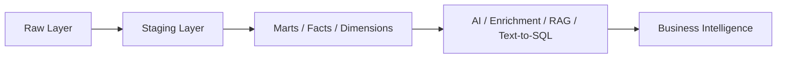
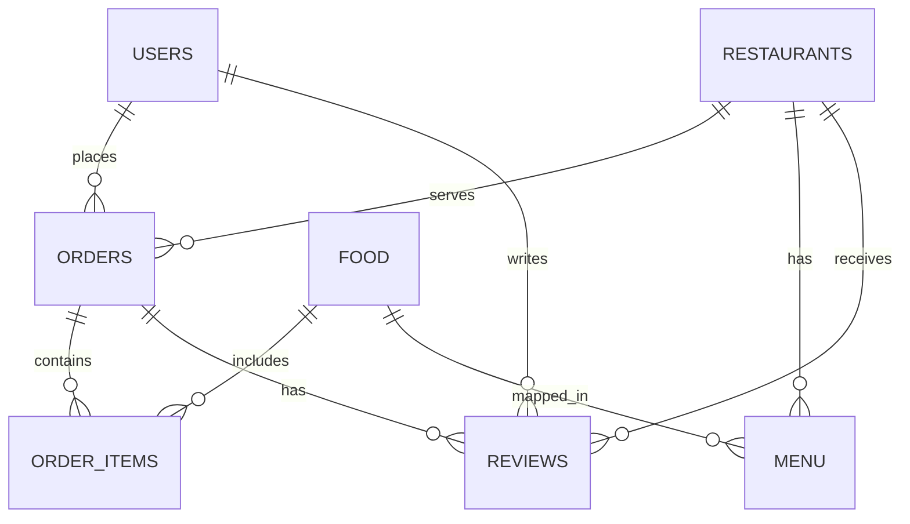
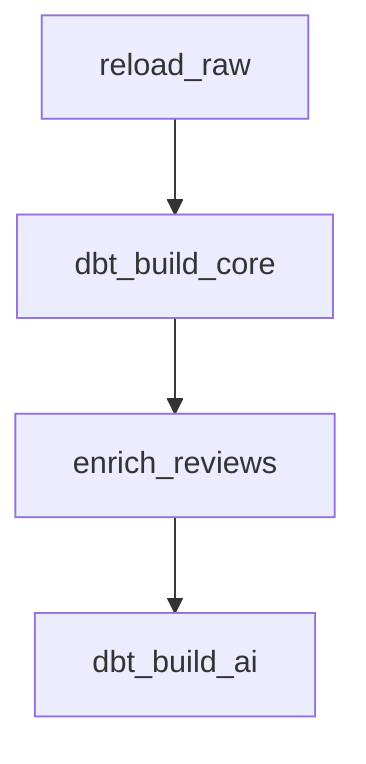

# Zomato AI Data Engineering — End-to-End Project

A complete batch data pipeline that takes Zomato-style food delivery data from raw CSVs all the way to AI-powered analytics.

Zomato/Food Delivery Dataset → Amazon S3 → Snowflake → dbt → Airflow → AI (OpenAI)

The dataset lands in an S3 data lake and flows into Snowflake through a storage integration, where dbt transforms it through medallion layers — RAW (Bronze) tables loaded via COPY INTO, cleaned STAGING (Silver) views, and business-ready MARTS (Gold) with dimensions, incremental facts, and aggregate marts. Apache Airflow orchestrates the whole pipeline as one daily DAG. On top of the warehouse sits an AI lane powered by OpenAI: LLM enrichment turns free-text reviews into structured, queryable columns; RAG lets you chat with your reviews; and text-to-SQL lets you query the warehouse in plain English. Streamlit serves the dashboards and AI apps.


> 📂 Dataset + project slides: [Google Drive folder](https://drive.google.com/drive/folders/1_xcTtGbuZYmWUAdXz8YB4qjainPr6D6V?usp=sharing) — the raw CSVs are kept outside the repo because they are too large to commit to GitHub.

---

## What gets built

| Layer | Where | What |
| --- | --- | --- |
| Source | local/raw data source | restaurant, user, food, menu, order, order_item, and review data |
| Lake | Amazon S3 | one bucket with raw folder structure per table |
| Bronze | Snowflake RAW | COPY INTO from S3 through storage integration |
| Silver | Snowflake STAGING | dbt staging views for cleaning, typing, and standardization |
| Gold | Snowflake MARTS | dimensions, incremental facts, aggregate marts, KPI tables |
| AI | Snowflake AI | review enrichment, RAG, text-to-SQL |
| Orchestration | Airflow (Docker) | daily DAG for load → transform → enrich → AI mart |

---

## Tech stack

Python · Pandas · Amazon S3 · Snowflake · dbt (dbt-snowflake) · Apache Airflow 3 (Docker) · OpenAI (gpt-4o-mini, text-embedding-3-small) · Streamlit

---

## Repository structure

```text
├── ai/
│   ├── enrich_reviews.py
│   ├── example.env
│   ├── rag_chat.py
│   └── text_to_sql.py
├── airflow/
│   ├── Dockerfile
│   ├── docker-compose.yaml
│   ├── example.env
│   └── dags/
│       └── zomato_batch.py
├── aws/
│   └── iam/
│       ├── s3-read-policy.json
│       ├── snowflake-role-trust-policy-final.json
│       └── snowflake-role-trust-policy-initial.json
├── docs/
│   ├── architecture.png
│   └── Zomato_Data_Model.jpg
├── snowflake/
│   ├── 01_setup.sql
│   ├── 02_storage_integration.sql
│   ├── 03_stage_and_formats.sql
│   ├── 04_raw_tables.sql
│   └── 05_copy_into.sql
├── zomato/
│   ├── README.md
│   ├── analyses/
│   ├── dbt_project.yml
│   ├── macros/
│   ├── models/
│   ├── snapshots/
│   └── tests/
├── .gitignore
├── README.md
├── LICENSE
└── .venv/
```

> The raw data files are intentionally not committed to GitHub because they are too large. Download them from the Drive link above and place them in your local raw-data location before running the pipeline.

---

## 1. Project flow overview

The complete flow of the solution is shown below.


This pipeline moves from raw source data to trusted analytics and AI-driven insights in a sequence that reflects a production data platform:

1. Raw datasets are collected from source files.
2. Data is staged into cloud storage and loaded into Snowflake.
3. dbt cleans, models, and transforms the data into analytical layers.
4. Airflow orchestrates scheduled and repeatable execution.
5. AI scripts enrich customer reviews and answer business questions using the warehouse.
6. Analysts and users consume trusted KPIs through marts and AI workflows.

---

## 2. How the pipeline works

### 1 · Data lands in S3

The source datasets are uploaded to S3 under a raw folder structure such as:

```text
s3://<BUCKET>/raw/<table>/
```

This keeps the raw data in a central storage layer before warehouse ingestion.

### 2 · S3 to Snowflake via keyless integration

Snowflake reads the bucket using a storage integration and IAM role, without storing long-lived AWS keys in the repo. The AWS JSON files under [aws/iam](aws/iam) are used to configure the trust relationship between the IAM role and Snowflake.

The flow is:

1. create AWS policy and role
2. create Snowflake storage integration
3. run DESC INTEGRATION to capture the identity values
4. update the role trust policy with Snowflake's IAM user ARN and external ID

### 3 · Load with COPY INTO

The DDL scripts in [snowflake/04_raw_tables.sql](snowflake/04_raw_tables.sql) create the raw tables, and [snowflake/05_copy_into.sql](snowflake/05_copy_into.sql) loads the data from S3 into Snowflake using COPY INTO.

This is where the raw bronze layer is created.

### 4 · Transform with dbt (medallion)

The project uses a medallion design:

- Raw / Bronze: incoming raw sources in Snowflake
- Staging / Silver: standardized and cleaned source models
- Marts / Gold: dimensions, insights, and business-ready aggregates

The dbt project under [zomato](zomato) creates staging models, dimensions, fact tables, and marts used for analytics.

### 5 · Orchestrate with Airflow

The DAG in [airflow/dags/zomato_batch.py](airflow/dags/zomato_batch.py) manages the workflow:

```text
reload_raw → dbt_build_core → enrich_reviews → dbt_build_ai
```

This keeps the loading, transformation, enrichment, and AI steps in one scheduled workflow.

### 6 · AI on top of the warehouse

The AI layer adds three capabilities:

- review enrichment using OpenAI
- RAG over review content
- text-to-SQL over warehouse tables

This turns the warehouse into an operational decision-support platform instead of a static reporting store.

---

## 3. Business use case

This project simulates a real food delivery analytics platform for a business that needs to answer questions like:

- Which cities generate the most revenue?
- Which restaurants perform best by rating and delivery time?
- What are the main delivery issues reported by customers?
- Which food items or cuisines are most popular?
- How can AI interpret review sentiment and improve business decisions?

The system helps connect raw operational data to business insight and action.

---

## 4. Medallion architecture




The project follows a medallion architecture to keep the data pipeline clean and scalable:

- Raw layer: ingests source files and stores them in a raw landing zone.
- Staging layer: standardizes column names, cleans values, and prepares the data for modeling.
- Mart layer: creates business-ready tables used for analysis and reporting.
- AI layer: enriches review content and answers natural-language business questions.

---

## 5. Data model and schema design

The project models the relationships between the core business entities in the food delivery domain.


This data model explains how the system works at the business level:

- a user places many orders
- an order belongs to a restaurant and a city
- an order contains multiple order items
- a menu item links to a food catalog item and restaurant pricing
- a review is associated with a user, restaurant, and order

This structure supports both operational analytics and customer-experience analysis.



---

## 6. Snowflake setup and connection flow

The warehouse layer is implemented in Snowflake. The setup is done in sequence using the scripts in the [snowflake](snowflake) folder.

### Setup scripts order

1. [snowflake/01_setup.sql](snowflake/01_setup.sql) - create warehouse, database, schemas, and role
2. [snowflake/02_storage_integration.sql](snowflake/02_storage_integration.sql) - create storage integration for S3 access
3. [snowflake/03_stage_and_formats.sql](snowflake/03_stage_and_formats.sql) - create stage and file formats
4. [snowflake/04_raw_tables.sql](snowflake/04_raw_tables.sql) - create raw tables
5. [snowflake/05_copy_into.sql](snowflake/05_copy_into.sql) - copy data from S3 into Snowflake

### Example environment variables

Create your environment file from [ai/example.env](ai/example.env) and [airflow/example.env](airflow/example.env) with values like:

```bash
SNOWFLAKE_ACCOUNT=your_account_identifier
SNOWFLAKE_USER=your_user_name
SNOWFLAKE_PASSWORD=your_password
SNOWFLAKE_WAREHOUSE=ZOMATO_WH
SNOWFLAKE_DATABASE=ZOMATO
SNOWFLAKE_SCHEMA=STAGING
OPENAI_API_KEY=your_openai_key
SAMPLE_N=5
```

> Do not commit real credentials to GitHub.

---

## 7. dbt setup and staging layer

The analytics layer is built with dbt. The setup process is important because it creates the base project that connects to Snowflake and builds the transformation pipeline.

### Install dbt for Snowflake

```bash
pip install dbt-snowflake
```

### Initialize a dbt project

```bash
dbt init project_name
```

When prompted, select the required option:

- choose database type: Snowflake
- select option 1 for Snowflake

Example answers:

```text
Which database would you like to use?
1. snowflake

Enter your account identifier:
<from Snowflake -> Profile -> Connect -> Account Identifier>

Enter your user name:
<from Snowflake Profile -> Connect tool -> dev username>

Enter your password:
<your Snowflake password or SSO/keypair-based auth>

Enter your role:
DBT_ROLE

Enter your warehouse:
ZOMATO_WH

Enter your database:
ZOMATO

Enter your schema:
STAGING

Enter number of threads:
8
```

### Validate connection

```bash
cd project_name
dbt debug
```

### Staging layer setup

The staging layer is where raw tables are cleaned and normalized. In this project, [zomato/models/staging](zomato/models/staging) contains the staging models such as:

- stg_orders.sql
- stg_order_items.sql
- stg_restaurants.sql
- stg_reviews.sql
- stg_users.sql
- stg_food.sql
- stg_menu.sql

Typical tasks include:

- naming normalization
- type casting
- null handling
- deduplication
- column mapping
- business standardization

### Build the project

```bash
dbt build --exclude tag:ai
```

---

## 8. Airflow orchestration

The orchestration layer is implemented with Apache Airflow, and the DAG is defined in [airflow/dags/zomato_batch.py](airflow/dags/zomato_batch.py).


### Airflow flow



### Start Airflow locally

```bash
cd airflow
cp example.env .env
docker compose build
docker compose up -d
```

Then open:

```text
http://localhost:8080
```

Unpause the DAG and trigger it when ready.

---

## 9. AI layer and business intelligence

The AI layer sits on top of the warehouse and adds intelligence to the analytical data.

### 1. Review enrichment

The script [ai/enrich_reviews.py](ai/enrich_reviews.py) sends review text to OpenAI and produces fields like:

- sentiment label
- sentiment score
- topic
- key issue

### 2. RAG over reviews

The script [ai/rag_chat.py](ai/rag_chat.py) enables natural-language questions over review data.

### 3. Text-to-SQL over warehouse

The script [ai/text_to_sql.py](ai/text_to_sql.py) translates plain-English questions into safe SQL and queries the Snowflake marts layer.

---

## 10. Running it

```bash
# 1. Create or update Snowflake objects
# run SQL files in order from snowflake/

# 2. Install dbt package
pip install dbt-snowflake

# 3. Initialize dbt project
dbt init project_name

# 4. Validate dbt connection
cd project_name
dbt debug

# 5. Build models
dbt build --exclude tag:ai

# 6. Start Airflow
cd airflow
cp example.env .env
docker compose up -d

# 7. Run AI enrichment
export OPENAI_API_KEY=your_key
python ai/enrich_reviews.py

# 8. Run AI apps
streamlit run ai/rag_chat.py
streamlit run ai/text_to_sql.py
```

---

## 11. Example analytical questions supported by the project

- Which city has the highest revenue?
- Which restaurants have the highest ratings?
- Which cuisines are most popular?
- What are the top delivery complaints?
- Which restaurants have the worst delivery SLA?
- Which customers are most engaged by reviews and order value?

---

## 12. Why this project is valuable

This project demonstrates a complete modern data engineering workflow:

- ingestion and storage
- warehouse architecture
- transformation with dbt
- orchestration with Airflow
- AI enrichment on trusted data
- analytical and natural-language business intelligence

It also shows that the developer understands both the technical stack and the business problem behind the data.

---

## 13. Future enhancements

Potential next improvements include:

- dashboarding with Streamlit or Metabase
- data quality monitoring and alerts
- incremental dbt logic for large datasets
- CI/CD for dbt and SQL validation
- real-time or event-driven ingestion
- advanced AI summarization and sentiment trend analysis

---

## 14. Final note

This repository is best understood as a modern data platform end-to-end project where the goal is not only to move data but to create a reliable, understandable, and AI-enabled business intelligence system.

The complete value comes from combining:

- warehouse design
- dbt transformation
- orchestration automation
- AI enrichment
- business insight generation

That combination is what makes this project strong for learning, demos, and portfolio presentation.

---

## Acknowledgement

This project is built to showcase real-world data engineering practices: ingestion, transformations, orchestration, and AI augmentation on top of analytical data.

